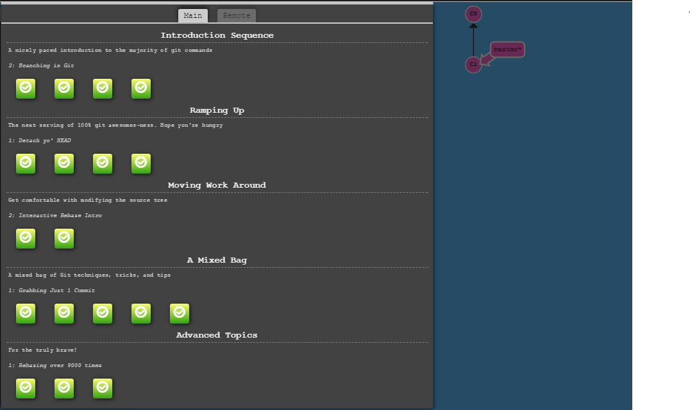

### HW0

**1. Basic course setup**  
Slack and Moodle profiles have been set up appropriately.  
Created a private repo called HW0 in NCSU github and added the collaborators.

**2. Learning Git**  
Screenshot showing completion of git tutorial  
  

**3. Hooks**  
A post-commit hook has been created and the script is given below:  

#!/bin/bash  
start https://www.ncsu.edu/  
exit 0  

**4. Screencast**  
The whole process of creating post-commit hooks has been recorded and the link to the demonstration is given below:  
[Post-commit hooks demo](https://drive.google.com/open?id=0Bz726MTdOBmOWDhBeERXcWFwR1k)
